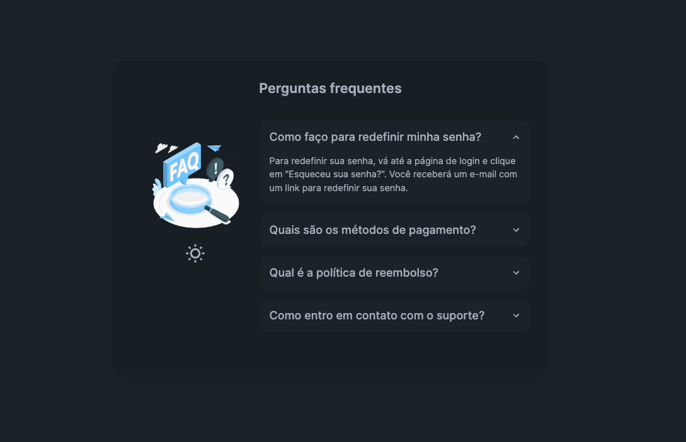

<h1 align="center">
    FAQ
</h1>

<p align="center">
  <a href="#sobre">Projeto</a>&nbsp;&nbsp;&nbsp;|&nbsp;&nbsp;&nbsp;
  <a href="#tecnologias">Tecnologias</a>&nbsp;&nbsp;&nbsp;|&nbsp;&nbsp;&nbsp;
  <a href="#setup">Setup</a>&nbsp;&nbsp;&nbsp;|&nbsp;&nbsp;&nbsp;
  <a href="#layout">Layout</a>&nbsp;&nbsp;&nbsp;|&nbsp;&nbsp;&nbsp;
  <a href="#licença">Licença</a>
</p>

<p align="center">
  
  
</p>

<div align="center">
  
  
  <a href="https://github.com/brunolagoa/next-faq/stargazers"></a>
  <a href="https://github.com/brunolagoa/next-faq/network/members"></a>
  <a href="https://github.com/brunolagoa/next-faq/pulls"></a>
  <a href="https://github.com/brunolagoa/next-faq/issues"></a>
  <a href="https://github.com/brunolagoa/next-faq/graphs/contributors"></a>
</div>

<br>

## Projeto

Página FAQ, construido com NextJS

## Tecnologias

Esse projeto foi desenvolvido com as seguintes tecnologias:

- [NextJS](https://nextjs.org)

## Setup

Clone o repositório em sua máquina:

`git clone https://github.com/BrunoLagoa/next-faq.git`

## Getting Started

Primeiro, execute o servidor de desenvolvimento:

```bash
npm run dev
# ou
yarn dev
# ou
pnpm dev
# ou
bun dev
```

Abra [http://localhost:3000](http://localhost:3000) com seu navegador para ver o resultado.

## Layout

<div align="center">
    
</div>
<br/><br/>

<p>Site publicado em:</p>
<a alt="Bruno Castro" target="_blank" rel="noopener noreferrer" href="next-faq.vercel.app">Clique aqui para visualizar</a>

---


## Licença

Esse projeto está sob a licença MIT. Veja o arquivo [LICENSE](LICENSE.md) para mais detalhes.

---

<h3 align="center">
Autor: <a alt="Bruno Castro" target="_blank" rel="noopener noreferrer" href="https://brunocastro.dev">Bruno Castro</a>
</h3>

<p align="center">

  <a alt="Bruno Castro Linkedin" rel="noopener noreferrer" href="https://www.linkedin.com/in/brunovcastro">
    </a>
  <a alt="Bruno Castro GitHub" rel="noopener noreferrer" href="https://github.com/brunolagoa">
  </a>
  <a alt="Bruno Castro Site" rel="noopener noreferrer" href="https://brunocastro.dev">
  </a>

</p>